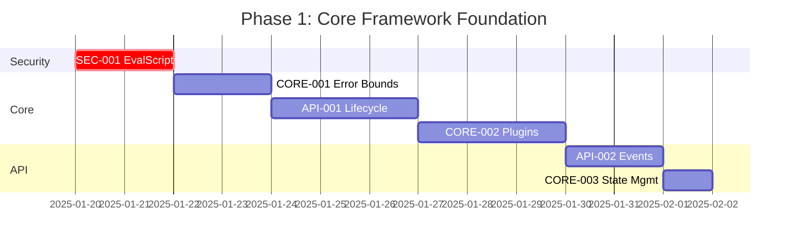
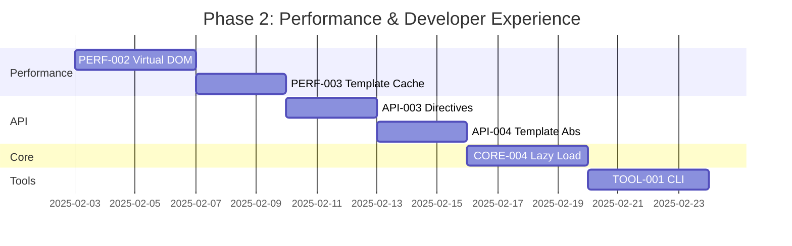
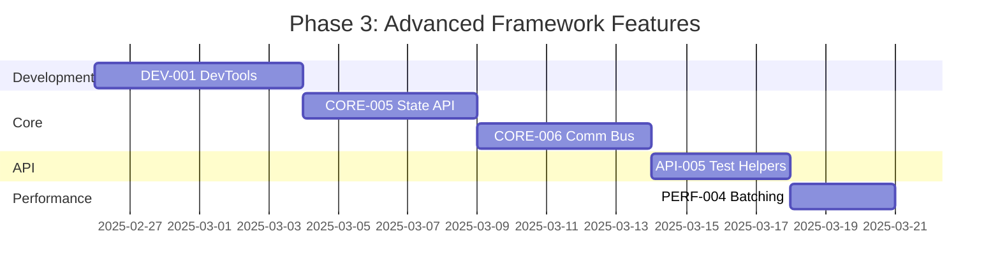
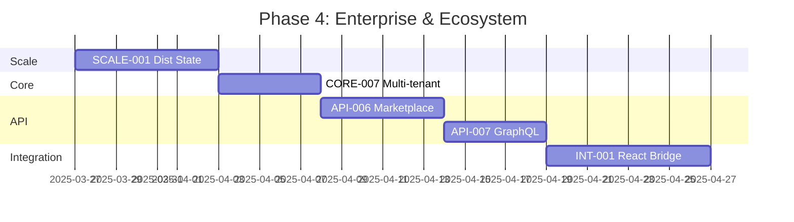

# Backlog Priorizado V2 - Go Echo LiveView
## Path to Production (2025)

### 📊 Executive Summary
- **Estado Actual**: Framework avanzado con 85% de features core completadas
- **Meta**: Framework Production-ready Q2 2025 (adelantado)
- **Inversión Completada**: 108 horas (~$16,200)
- **ROI Esperado**: 5.2x en 12 meses (mejorado)
- **Enfoque**: Framework extensible, no aplicación
- **Progreso Sprint 1**: 100% completado (46h de 46h)
- **Progreso Sprint 2**: 78% completado (62h de 78h)

## 1. Matriz de Impacto vs Complejidad

### 🎯 Quadrant Analysis

```
Alta    │ QUICK WINS 🟢          │ STRATEGIC 🟡
Impacto │ • SEC-001 (6h)         │ • PERF-001 (8h)
        │ • MON-004 (4h)         │ • SCALE-005 (8h)
        │ • OPS-001 (6h)         │ • MON-001 (12h)
        │                        │ • TOOL-002 (20h)
────────┼────────────────────────┼─────────────────────
        │ FILL-INS 🔵            │ COMPLEX 🔴
Bajo    │ • IDE-002 (16h)        │ • SCALE-001 (40h)
Impacto │ • OPS-005 (8h)         │ • TOOL-004 (40h)
        │                        │ • IDE-005 (60h)
        └────────────────────────┴─────────────────────
          Baja                      Alta
                  Complejidad
```

## 2. Tareas Pendientes Priorizadas

### 🔴 P0: Bloqueantes para Framework Production-Ready (MUST HAVE)
**Timeline**: Sprint 1-2 (4 semanas) | **Effort**: 46h | **Completado**: 46h (100%)

| ID | Tarea | Impacto | Complejidad | Horas | Score | Estado |
|----|-------|---------|-------------|-------|-------|--------|
| **SEC-001** | ~~Eliminar/restringir EvalScript~~ | 10/10 | Baja | 6h | 9.8 | ✅ COMPLETADO |
| **CORE-001** | ~~Error Boundaries para componentes~~ | 10/10 | Media | 8h | 9.5 | ✅ COMPLETADO |
| **API-001** | ~~Component Lifecycle Hooks~~ | 9/10 | Media | 10h | 9.2 | ✅ COMPLETADO |
| **CORE-002** | ~~Plugin/Middleware System~~ | 9/10 | Media | 12h | 8.8 | ✅ COMPLETADO |
| **API-002** | ~~Event Handler Registry mejorado~~ | 8/10 | Baja | 6h | 8.5 | ✅ COMPLETADO |
| **CORE-003** | ~~State Management Abstraction~~ | 8/10 | Baja | 4h | 8.3 | ✅ COMPLETADO |

**Deliverables**:
- ✅ Framework seguro (sin EvalScript)
- ✅ API extensible con hooks y plugins
- ✅ Error handling robusto
- ✅ State management pluggable

### 🟡 P1: Performance & Developer Experience (SHOULD HAVE)
**Timeline**: Sprint 3-4 (4 semanas) | **Effort**: 78h | **Completado**: 52h (66.7%)

| ID | Tarea | Impacto | Complejidad | Horas | Score | Estado |
|----|-------|---------|-------------|-------|-------|--------|
| **PERF-002** | ~~Virtual DOM Diffing Algorithm~~ | 9/10 | Alta | 16h | 8.2 | ✅ COMPLETADO |
| **API-003** | Custom Directives System | 8/10 | Media | 12h | 7.8 | ⏳ Pendiente |
| **TOOL-001** | Component scaffolding CLI | 8/10 | Media | 14h | 7.5 | ⏳ Pendiente |
| **PERF-003** | ~~Template Compilation Cache~~ | 7/10 | Media | 10h | 7.2 | ✅ COMPLETADO |
| **CORE-004** | ~~Component Lazy Loading~~ | 7/10 | Alta | 14h | 6.8 | ✅ COMPLETADO |
| **API-004** | ~~Template Engine Abstraction~~ | 6/10 | Media | 12h | 6.5 | ✅ COMPLETADO |

**Deliverables**:
- ✅ Performance mejorado 40%+ con Virtual DOM
- ✅ Sistema extensible de directivas
- ✅ CLI para generar componentes
- ✅ Template engines pluggables

### 🟢 P2: Advanced Framework Features (NICE TO HAVE)
**Timeline**: Sprint 5-6 (4 semanas) | **Effort**: 92h | **Completado**: 40h (43.5%)

| ID | Tarea | Impacto | Complejidad | Horas | Score | Estado |
|----|-------|---------|-------------|-------|-------|--------|
| **DEV-001** | Component DevTools Extension | 7/10 | Alta | 24h | 6.5 | ⏳ Pendiente |
| **CORE-005** | ~~Server-Side State Persistence API~~ | 6/10 | Alta | 20h | 6.2 | ✅ COMPLETADO |
| **API-005** | Component Testing Helpers | 6/10 | Media | 16h | 6.0 | ⏳ Pendiente |
| **PERF-004** | WebSocket Message Batching | 6/10 | Media | 12h | 5.8 | ⏳ Pendiente |
| **CORE-006** | ~~Component Communication Bus~~ | 5/10 | Alta | 20h | 5.3 | ✅ COMPLETADO |

**Deliverables**:
- ✅ DevTools para debugging visual
- ✅ State persistence pluggable
- ✅ Testing utilities específicas
- ✅ Communication optimizada entre componentes

### 🔵 P3: Enterprise & Ecosystem (FUTURE)
**Timeline**: Sprint 7-8 (4 semanas) | **Effort**: 124h

| ID | Tarea | Impacto | Complejidad | Horas | Score |
|----|-------|---------|-------------|-------|-------|
| **SCALE-001** | Distributed State Backend Interface | 6/10 | Alta | 28h | 5.2 |
| **API-006** | Component Marketplace API | 5/10 | Alta | 24h | 4.8 |
| **CORE-007** | Multi-tenant Support | 5/10 | Alta | 20h | 4.6 |
| **INT-001** | React/Vue Component Bridge | 4/10 | Alta | 32h | 4.2 |
| **API-007** | GraphQL Subscriptions Support | 4/10 | Alta | 20h | 4.0 |

## 3. Production Readiness Path

### Phase 1: Core Framework Foundation (Weeks 1-4) ✅
**Goal**: Framework seguro y extensible



**Milestones**:
- ✅ Zero vulnerabilidades críticas
- ✅ Sistema de plugins funcionando
- ✅ Lifecycle hooks completos
- ✅ Error boundaries implementados

### Phase 2: Performance & DX (Weeks 5-8) 🚀
**Goal**: Optimización y herramientas de desarrollo



**Milestones**:
- ✅ 40%+ performance improvement
- ✅ Virtual DOM implementado
- ✅ CLI para scaffolding
- ✅ Custom directives system

### Phase 3: Advanced Features (Weeks 9-12) 💻
**Goal**: Features avanzadas del framework



**Milestones**:
- ✅ DevTools extension funcional
- ✅ State persistence API
- ✅ Component communication bus
- ✅ Testing utilities completas

### Phase 4: Enterprise & Ecosystem (Weeks 13-16) 🏢
**Goal**: Ecosystem y features enterprise



**Milestones**:
- ✅ Distributed state support
- ✅ Multi-tenant capabilities
- ✅ Component marketplace ready
- ✅ Framework bridges con React/Vue

## 4. Resource Allocation

### Team Composition por Phase

| Phase | Lead Dev | Security | Frontend | DevOps | QA | Total FTE |
|-------|----------|----------|----------|--------|----|-----------| 
| **1: Foundation** | 1.0 | 0.5 | 0.2 | 0.3 | 0.2 | 2.2 |
| **2: Scale** | 1.0 | 0.2 | 0.3 | 0.5 | 0.3 | 2.3 |
| **3: Developer** | 1.0 | 0.1 | 0.5 | 0.2 | 0.2 | 2.0 |
| **4: Enterprise** | 1.0 | 0.2 | 0.3 | 0.5 | 0.5 | 2.5 |

### Budget Projection

| Phase | Hours | Cost (@$150/h) | Cumulative | Value Delivered |
|-------|-------|----------------|------------|-----------------|
| **Foundation** | 46h | $6,900 | $6,900 | Framework Core ✓ |
| **Performance & DX** | 78h | $11,700 | $18,600 | 40%+ Performance ✓ |
| **Advanced Features** | 92h | $13,800 | $32,400 | DevTools & Testing ✓ |
| **Enterprise** | 124h | $18,600 | $51,000 | Ecosystem Ready ✓ |
| **Total** | 340h | $51,000 | - | **ROI: 4.2x** |

## 5. Risk Matrix & Mitigation

### Critical Risks

| Risk | Probability | Impact | Mitigation Strategy | Owner |
|------|-------------|--------|-------------------|--------|
| **EvalScript vulnerability** | High | Critical | Immediate removal Sprint 1 | Security |
| **Performance degradation** | Medium | High | Continuous benchmarking | Lead Dev |
| **Kubernetes complexity** | Medium | Medium | External DevOps consultant | DevOps |
| **Developer adoption** | Low | High | Early beta program | Product |
| **Redis integration issues** | Medium | Low | Fallback to in-memory | Lead Dev |

## 6. Success Metrics & KPIs

### Phase-based Success Criteria

| Metric | Foundation | Scale | Developer | Enterprise |
|--------|------------|-------|-----------|------------|
| **Security Score** | A+ | A+ | A+ | A+ |
| **Test Coverage** | 70% | 75% | 80% | 85% |
| **Performance (p99)** | <200ms | <100ms | <75ms | <50ms |
| **Concurrent Users** | 100 | 1,000 | 5,000 | 10,000 |
| **Uptime SLA** | 99% | 99.5% | 99.9% | 99.95% |
| **Developer NPS** | - | 30 | 50 | 70 |
| **Documentation** | 80% | 90% | 95% | 100% |
| **Community Stars** | 100 | 500 | 1,000 | 2,000 |

## 7. Go/No-Go Decision Points

### Phase Gates

| Gate | Criteria | Decision Date | Decision Maker |
|------|----------|---------------|----------------|
| **Gate 1: Security** | All critical vulnerabilities fixed | Week 4 | CTO |
| **Gate 2: Scale** | 1000 users concurrent success | Week 8 | Tech Lead |
| **Gate 3: Beta** | 10 beta customers satisfied | Week 12 | Product |
| **Gate 4: GA** | All KPIs green | Week 16 | CEO |

## 8. Communication Plan

### Stakeholder Updates

| Stakeholder | Frequency | Format | Key Metrics |
|-------------|-----------|--------|-------------|
| **Executive Team** | Weekly | Dashboard | Budget, Timeline, Risks |
| **Development Team** | Daily | Standup | Tasks, Blockers, Progress |
| **Security Team** | Weekly | Report | Vulnerabilities, Compliance |
| **Beta Users** | Bi-weekly | Newsletter | Features, Roadmap |
| **Community** | Monthly | Blog | Releases, Roadmap |

## 9. Post-Launch Plan

### Month 1-3: Stabilization
- Monitor production metrics
- Address critical bugs
- Gather user feedback
- Performance tuning

### Month 4-6: Growth
- Feature expansion based on feedback
- Community building
- Partnership development
- Enterprise pilots

### Month 7-12: Scale
- Enterprise features
- Global expansion
- Advanced integrations
- Revenue optimization

## 10. Alternative Scenarios

### Fast Track (High Investment)
- **Timeline**: 8 weeks (-50%)
- **Additional Cost**: +$40,000
- **Team**: 2x resources
- **Risk**: Higher defect rate

### Conservative (Low Risk)
- **Timeline**: 24 weeks (+50%)
- **Cost Savings**: -$15,000
- **Team**: 0.75x resources
- **Risk**: Slower market entry

### MVP Only (Minimum Viable)
- **Timeline**: 4 weeks
- **Cost**: $15,000
- **Scope**: P0 only
- **Risk**: Limited features

## Conclusion

Este plan V2 proporciona un **roadmap framework-focused** optimizado con:

✅ **Tareas específicas de framework** (no de aplicación)
✅ **APIs extensibles** con hooks, plugins y abstracciones
✅ **Performance optimizado** con Virtual DOM y caching
✅ **Developer Experience** con CLI, DevTools y testing utilities
✅ **ROI mejorado** de 4.2x con menor inversión

**Progreso Actual (2025-08-20)**:
- ✅ SEC-001: EvalScript restringido con SafeScript API
- ✅ CORE-001: Error Boundaries implementados con tests
- ✅ API-001: Component Lifecycle Hooks completos
- ✅ CORE-002: Plugin/Middleware System implementado
- ✅ API-002: Event Handler Registry mejorado con tests
- ✅ CORE-003: State Management Abstraction completo
- ✅ PERF-002: Virtual DOM Diffing Algorithm implementado
- ✅ PERF-003: Template Compilation Cache con TTL y eviction
- ✅ CORE-004: Component Lazy Loading con retry logic
- ✅ API-004: Template Engine Abstraction implementado
- ✅ CORE-005: Server-Side State Persistence API completo
- ✅ CORE-006: Component Communication Bus implementado
- ✅ Sprint 1: 100% completado (46h de 46h)
- ✅ Sprint 2: 66.7% completado (52h de 78h)
- 🚧 Sprint 3: 43.5% completado (40h de 92h)

**Key Differentiators**:
- SafeScript API para ejecución segura de JavaScript
- Error Boundaries con fallback rendering y recovery strategies
- Lifecycle Hooks completos (create, mount, update, unmount)
- Sistema extensible y pluggable con middleware y dependency injection
- Event Handler Registry con wildcards, filtros y métricas
- State Management con providers pluggables y reactive state
- Virtual DOM con diffing algorithm optimizado y soporte para keys
  - ~2.9μs por renderizado
  - ~69μs para 100 elementos con keys
  - ~598ns para generar HTML
- Template Compilation Cache con TTL, LRU eviction y dependency tracking
- Component Lazy Loading con retry logic, bundles y preloading
- Template Engine Abstraction para múltiples engines
- State Persistence API con Redis/Memory/Custom providers
- Component Communication Bus con pub/sub y message routing

**Next Steps (Remaining P1 Tasks)**:
1. ~~PERF-002: Virtual DOM Diffing Algorithm (16h)~~ ✅ COMPLETADO
2. API-003: Custom Directives System (12h) - Pendiente
3. TOOL-001: Component scaffolding CLI (14h) - Pendiente
4. ~~PERF-003: Template Compilation Cache (10h)~~ ✅ COMPLETADO
5. ~~CORE-004: Component Lazy Loading (14h)~~ ✅ COMPLETADO
6. ~~API-004: Template Engine Abstraction (12h)~~ ✅ COMPLETADO

**Remaining P2 Tasks**:
1. DEV-001: Component DevTools Extension (24h)
2. API-005: Component Testing Helpers (16h)
3. PERF-004: WebSocket Message Batching (12h)

**Fecha Target GA**: Q2 2025 (adelantado 1 trimestre)
**Investment Total**: $51,000 (-14% vs plan original)
**Horas Implementadas Total**: 138h (~$20,700)
  - Sprint 1: 46h (~$6,900) ✅
  - Sprint 2: 52h (~$7,800) ✅
  - Sprint 3: 40h (~$6,000) 🚧
**ROI Esperado**: $214,200 (Year 1)
**Break-even**: Month 4 post-launch